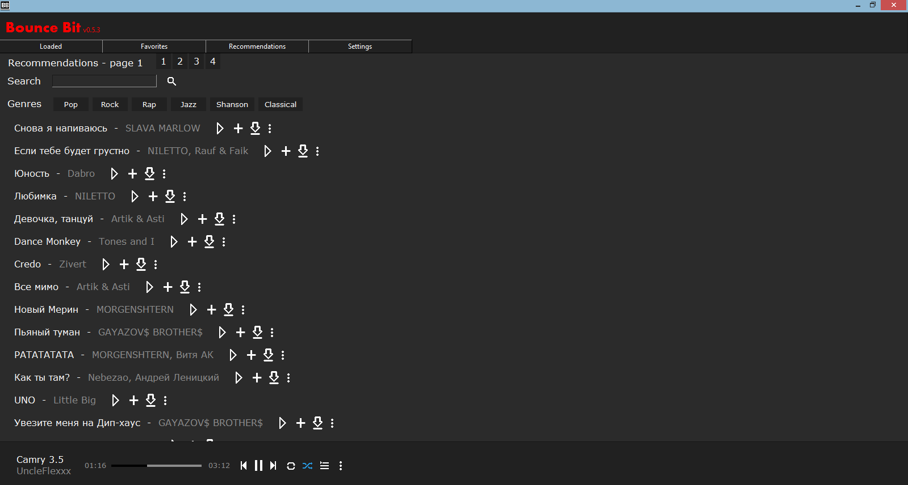
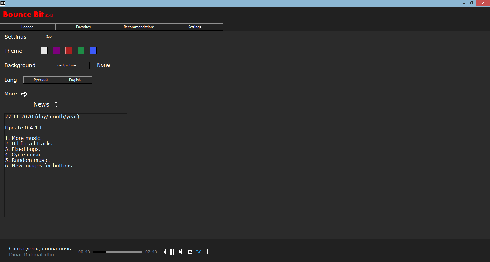

# BounceBit
Program for listen music free

# Download
This program is currently on google drive.  
Click <a href="https://drive.google.com/uc?export=download&id=1AiDdvaUmCRAvvDnCvB7ubP0NCuN2j5lr/">THIS</a> for download

# Create EXE
1. Download git repository
2. In file 'BounceBit.spec' edit pathex - set path to main file
3. Install all packages
4. Install <a href="https://pypi.org/project/pyinstaller/">Pyintaller</a>
5. Open command line and go to folder with main file
6. Write to command line: pyinstaller BounceBit.spec
7. In folder 'dist' will be BounceBit.exe

# New
   Version 0.5.4
1. Added hot keys (Up - Up volume, Down - Down volume)
2. Fixed hot keys with search line
3. Added playlist "Playing now"
4. Fixed settings interface
5. Fixed some bugs

# Packages
<code> pip install lxml </code>  
<code> pip install Pillow </code>  
<code> pip install pyglet </code>  
<code> pip install mutagen </code>  
<code> pip install requests </code>  
<code> pip install pyperclip </code>  
<code> pip install gc-python-utils </code>
