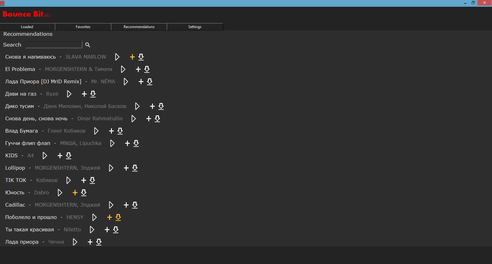
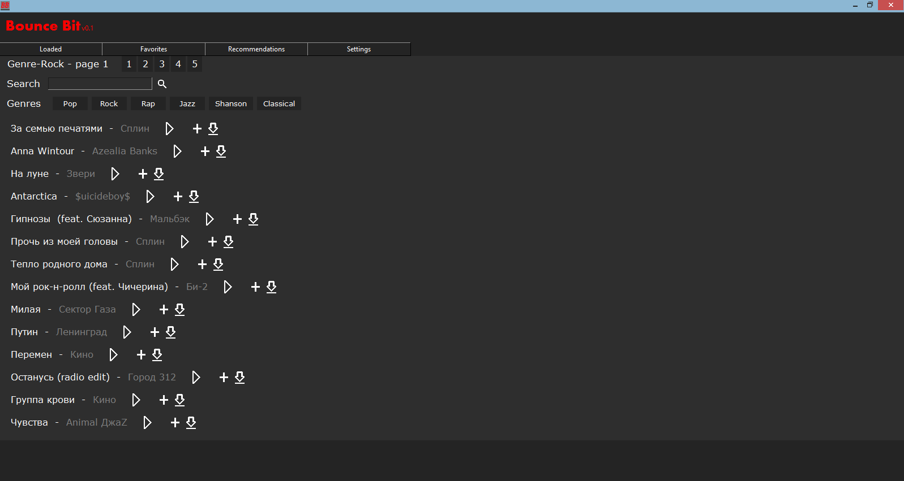

# BounceBit
Program for listen music free

# Packages
<code> pip install lxml </code>  
<code> pip install numpy </code>  
<code> pip install Pillow </code>  
<code> pip install pyglet </code>  
<code> pip install mutagen </code>  
<code> pip install requests </code>  
<code> pip install gc-python-utils </code>
