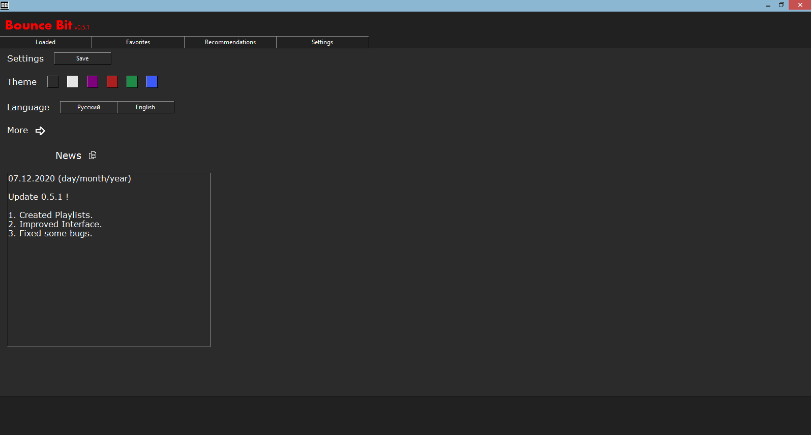

# BounceBit
Program for listen music free

# Create EXE
1. Download git repository
2. In file 'BounceBit.spec' edit pathex - set path to main file
3. Install all packages
4. Install <a href="https://pypi.org/project/pyinstaller/">Pyintaller</a>
5. Open command line and go to folder with main file
6. Write to command line: pyinstaller main.spec
7. In folder 'dist' will be BounceBit.exe

# New
   Version 0.4.1
1. More music
2. Song url
3. Fixed some bugs
4. Button cycle song
5. Button random song
6. New images for buttons

# Packages
<code> pip install lxml </code>  
<code> pip install numpy </code>  
<code> pip install Pillow </code>  
<code> pip install pyglet </code>  
<code> pip install mutagen </code>  
<code> pip install requests </code>  
<code> pip install pyperclip </code>  
<code> pip install gc-python-utils </code>
